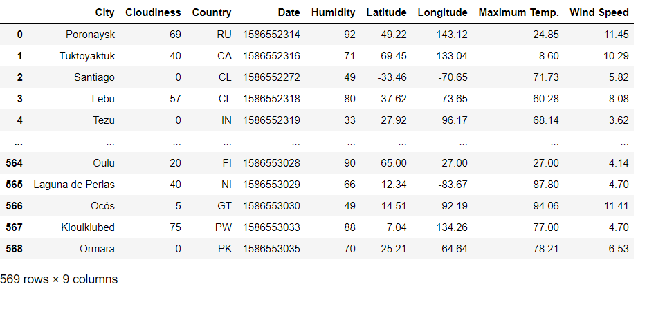
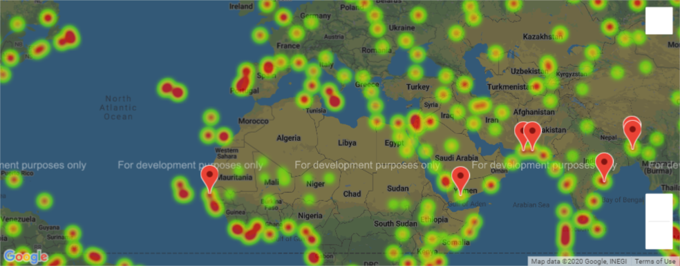
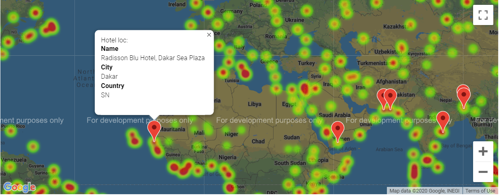
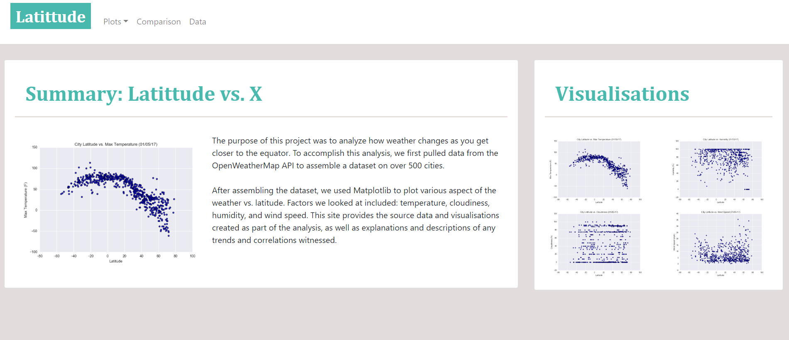

# Choose the Location with Ideal Weather for your next Vacation!
Created a Python script to visualize the weather of 500+ cities across the world of varying distance from the equator using the Google maps and Open Weather Maps API. Analysed weather correlations with the latitude and built a dashboard using HTML, CSS to display the analysis.

## Narrative
1. Understand correlation of several weather factors such as temperature, cloudiness, humidity, wind speed with the latitude in both, the southern and northern hemisphere. 
2. Reset ideal weather conditions as per one's own preference to find hotels in the those cities.

## Tools and Technologies used and required to run the file
* Python 3
    - Libraries :- Pandas, Matplotlib, Scipy, Time, NumPy, Requests, Json, Datetime, Gmaps and OS
* Jupyter Notebook
* HTML
* Bootstrap 
* CSS
* OWM API key (To get your own key:- https://openweathermap.org/appid )
* Google Maps API key (To get your own key:- https://developers.google.com/maps/documentation/javascript/get-api-key )
* Github pages to launch the dashboard

## How to run the code
1. Download and save the files "WeatherPy.ipynb" from the "WeatherPy" folder and the file "VacationPy.ipynb" from the "VacationPy" folder of the repository to a folder on your computer.
2. Open your terminal, cd into the folder you saved the files in.
3. Run the command "jupyter notebook". This will open the folder in the Jupyter Notebook website.
4. Open the WeatherPy file and enter your OWM key at the prompt in the first cell, run all cells by Kernel -> Restart and Run all
    - Note:- The file will take time to run because of a function that will make the API calls to sleep for 1.1 second after each call. That is because it runs 616 API calls and the free gmaps API allows only 600 calls per minute. 
5. Open the VacationPy file and enter your Google maps key at the prompt in the first cell, run all cells by Kernel -> Restart and Run all. You can also enter desired weather conditions in the 4th cell to suit your preference, before running the program.

6. To view the dashboard- https://akshitap31.github.io/web-design-challenge/index.html

## Output
1. Output.csv :- List of 500+ cities with their weather details

2. Heatmap of Humidity and the cities

3. Hotel pins on the ideal weather condition locations 

4. Visualisation dashboard

